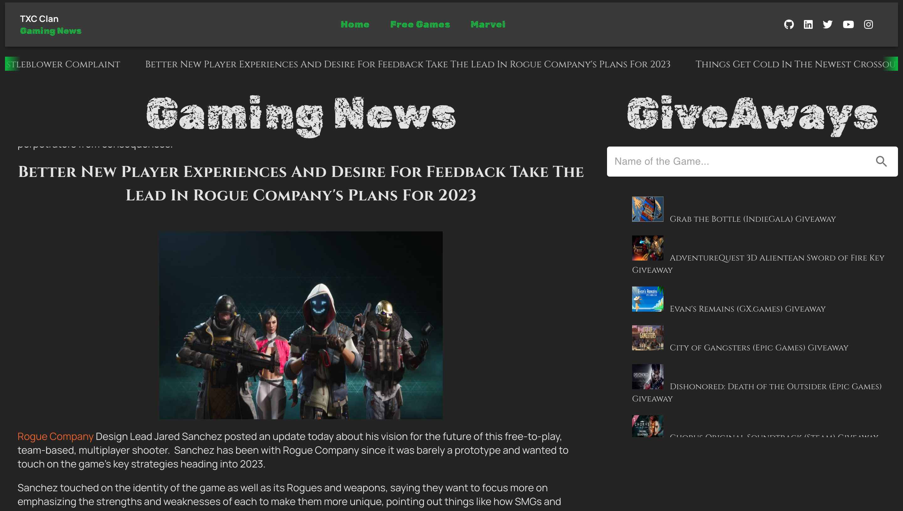
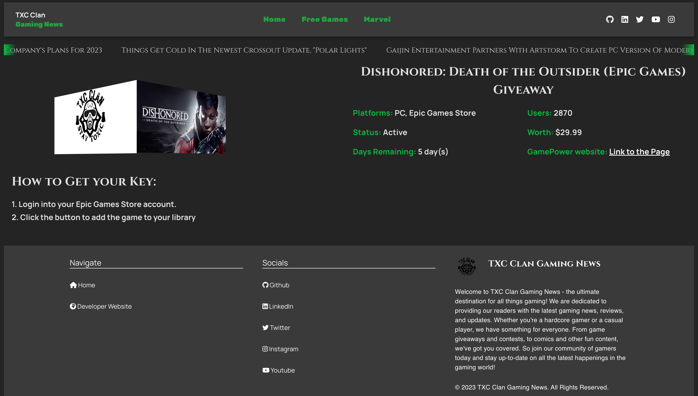
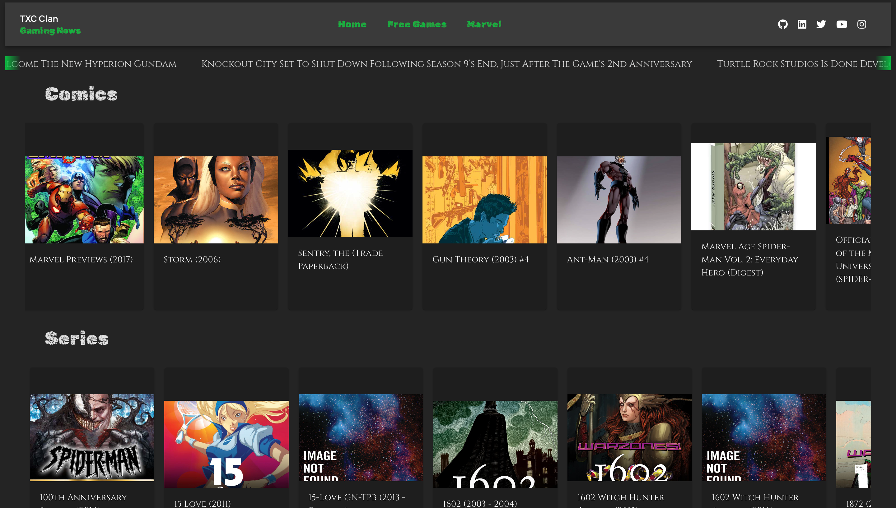

# TXC Gaming News
# Author:
KEITH WESLEY

# Description:
Welcome to the ultimate destination for all things gaming! Our website is dedicated to providing you with the latest news and updates from the world of gaming, as well as expert recommendations on the best games to play.
Whether you're a hardcore gamer or just getting into the hobby, we've got something for you. Our news section keeps you up-to-date on the latest releases and announcements, while our reviews and previews give you an in-depth look at the games you care about.
But we don't just tell you what to play – we also help you discover new games you might not have heard of. Our expert staff scours the internet to find the most exciting and innovative titles, and we make sure to cover a wide range of genres and platforms, so there's always something new to explore.
In addition to news and reviews, we also offer a variety of other features to enhance your gaming experience. From tips and tricks to guides and walkthroughs, we've got you covered. And with our community forums, you can connect with other gamers from around the world and share your thoughts and experiences.
So if you're looking for the latest gaming news, reviews, and recommendations, look no further. Our website has everything you need to stay up-to-date and find your next favorite game. Thank you for visiting

# Project Images:

    
    
    

# Technologies used:

<ol>
    <li>React JS</li>
    <li>Vite react app</li>
    <li>Material UI</li>
</ol>

# APIs used:
<ol>
    <li><a href="https://developer.marvel.com/" target="_blank" rel="noreferrer">Marvel API</a></li>
    <li><a href="https://www.mmobomb.com/" target="_blank" rel="noreferrer">MMO Bomb API</a></li>
    <li><a href="https://www.gamerpower.com/" target="_blank" rel="noreferrer">GamePower API</a></li>
    <li><a href="https://www.freetogame.com/api-doc" target="_blank" rel="noreferrer">Free2Play Games Database API</a></li>
</ol>

# Deployment Link:

:globe_with_meridians: https://txc-gaming-news.netlify.app/

# License

[MIT LICENSE](./LICENSE)